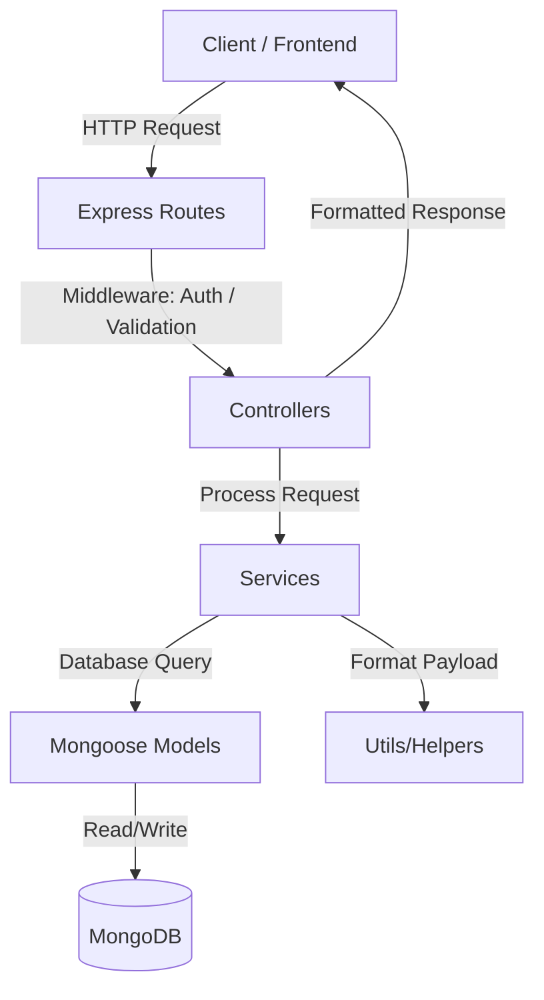

# Backend Architecture Design

This document describes the architectural layout and design patterns chosen for the **Voice Karar** backend service.

## Core Design Principles

1. **Separation of Concerns (SoC)**
   - The application enforces a strict division between network layers, logic layers, database mapping layer, and request payload parsers.

2. **Clean Layered Architecture**
   - **Routes Layer**: Handles URL entry points and calls specific controller handlers.
   - **Controllers Layer**: Validates structural payloads, un-envelops HTTP requests, delegates work to the services layer, and handles HTTP responses.
   - **Services Layer**: Encapsulates core business rules (e.g., share token generation, MongoDB write-reads, hashing, signing). Completely independent of Express objects (`req`, `res`).
   - **Models Layer**: MongoDB collections mapping schemas using Mongoose.
   - **Utils Layer**: Generic building blocks like custom wrappers (`ApiError.js`, `ApiResponse.js`) or single-purpose components (token builders, loggers).

3. **Domain Modules Representation**
   - **Auth Module**: Manages registration, signing tokens, passwords encryption.
   - **Agreement Module**: Converts raw voice transcript structures into database models, generates unique reference tokens.
   - **Confirmation Module**: Traces agreement confirmations, digital approvals, and captures histories.

