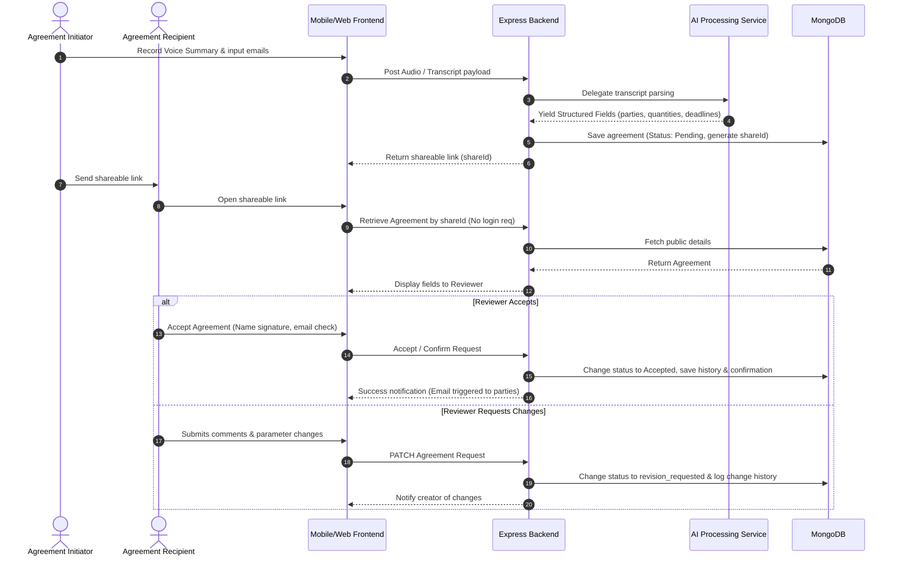

# Voice Karar System Workflow

This document illustrates the sequence of actions across systems to convert informal voice summaries into digitally accepted contracts.

## Workflow Execution Sequence

